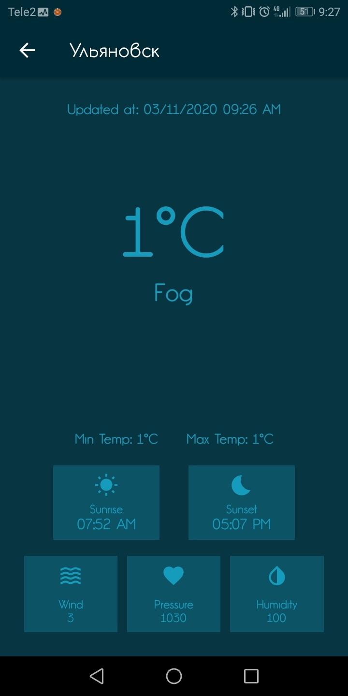
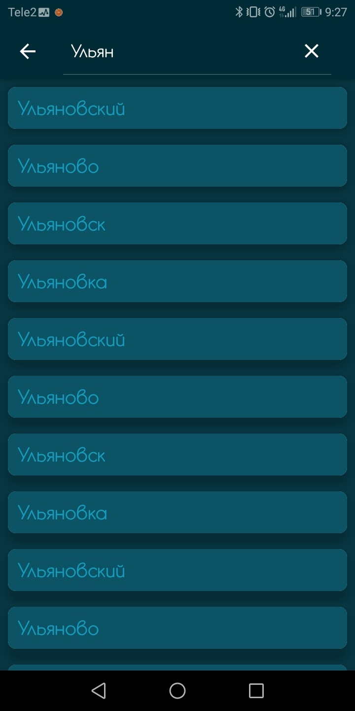
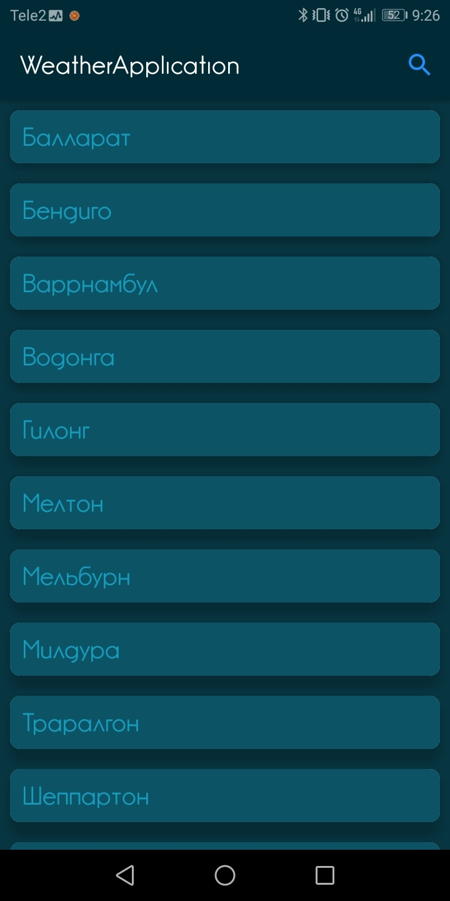

# WeatherApplication
[](https://travis-ci.com/PawMaw/WeatherApplication.svg?branch=master)

Павел Матвеев
Задание Mobile Android/Kotlin
### Описание

Приложение Погода.
Использемые ресурсы:
- [Cities] - Json объект с огромным количеством городов
- [OpenWeather] - API для работы с данными о погоде в разных городах мира.

[Cities]: <https://raw.githubusercontent.com/aZolo77/citiesBase/master/cities.json>
[OpenWeather]: <https://openweathermap.org/>

### Установка
Для установки проекта требуется просто открыть его в Android Studio и вставить ваш API Key от Weather Api в Detail Activity.


Для тестирования потребуется устройство с операционной системой Android ```>=8.0.0```

### Обновления
Прототипу были добавлены функции выбора даты для просмотра погоды для конкретного города. 
На первом скриншоте показаны две кнопки - пользователю можно выбирать отрезки по 4 часа(особенности API запроса) на которых будет показана погода. 
Поиск по городам показан на третьем скриншоте. Для удобства на главном экране сперва подгружается список городов для 
просмотра и производится выборка в строке поиска. Список городов для выбора очень обширный и не всегда указанные города есть в API, около 64 тысяч. 

### Скриншоты приложения



